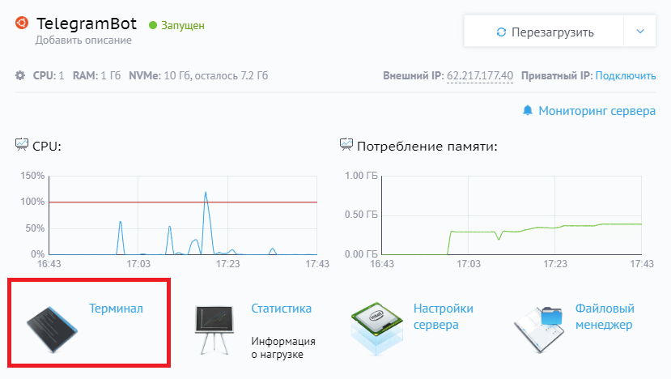
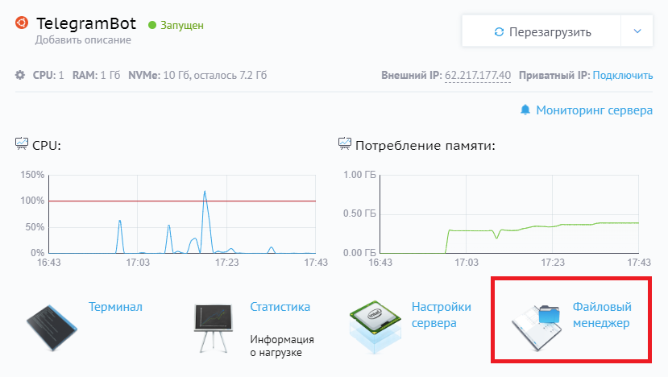
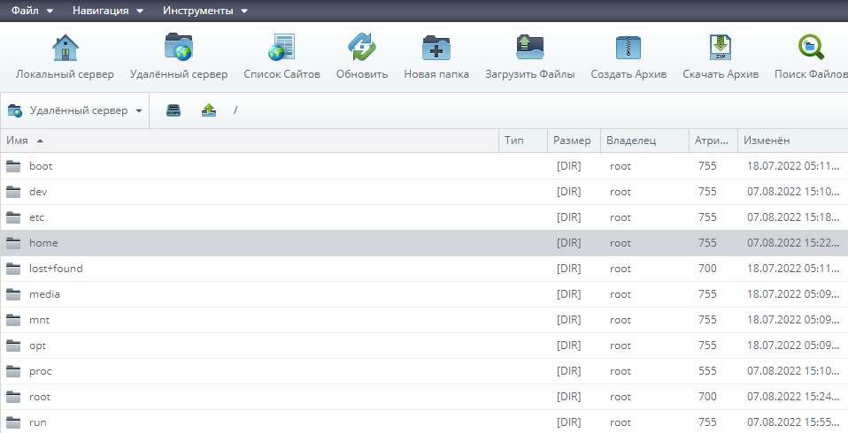


<h1>Размещаем телеграм-бота  на сервер</h1>
В этой статье я постараюсь коротко продемонстрировать процесс размещения телеграм-бота, написанного на языке программирования <b><i>python</i></b>.

<h2>Хостинг для телеграм-бота</h2>
Используем удобный сервис <b><a href="https://cp.beget.com">Beget</a></b> со встроенным файловым менеджером и терминалом.
 Для телеграм-бота хватит минимальной конфигурации виртуального сервера стоимостью 7 рублей в день.

<h2>Настраиваем сервер для Telegram-бота</h2>
 
 
На странице купленного нами сервера открываем терминал, в нем мы можем управлять сервером, подгружать нужные нам модули и библиотеки. Этим и займемся.
 Устанавливаем python3. 
Для этого введем в консоль сервера следующие команды:  

    sudo apt --reinstall install python3 -y  
    sudo apt --reinstall install python3-pip -y

Не забудем и про библиотеки. Для установки введем команду:

    pip3 install <название библиотеки>

Теперь нам нужно установить удобный менеджер процессов PM2 и язык программирования NodeJS с менеджером пакетов npm для его работы:

    sudo apt install nodejs
    sudo apt install npm
    npm install pm2 -g

<h2>Загружаем чат-бота</h2>
Вернемся на страницу сервера и откроем менеджер файлов. 
 
 
Перейдем в каталок home и создадим папку bot,   в которую загрузим все файлы к нашему проекту. 
  

<h2>Запускаем бота</h2>
Бот готов к запуску! Для этого в консоли сервера поочередно вводим команды:  

    cd /
    cd home/bot
    pm2 start main.py --interpreter=python3 (замените main на имя исполняемого файла бота)

Бот запущен и работает. Чтобы удостовериться в этом, мы можем ввести в консоли сервера команду менеджера процессов:

    pm2 list

Команда выдаст в консоли список процессов, запущенных на сервере. Найдите строчку с названием бота. Если напротив нее в столбце «Status» значится «Online», бот успешно запущен.

<h2>Перезапуск бота в случае падения сервера</h2>
Все сервера так или иначе иногда перезагружаются и процессы останавливаются. Можете убедиться в этом нажав на *Перезагрузить* на странице сервера.
Решается это вводом двух команд:

    pm2 save
    pm2 startup

 

<h3>Другие команды pm2</h3>

    pm2 stop <идентификатор процесса> - остановка процесса
    pm2 delete <идентификатор процесса> - удаление процесса
    pm2 logs <идентификатор процесса> - выводит выходные данные процесса
    pm2 unstartup - отключает перезапуск процессов при падении сервера

